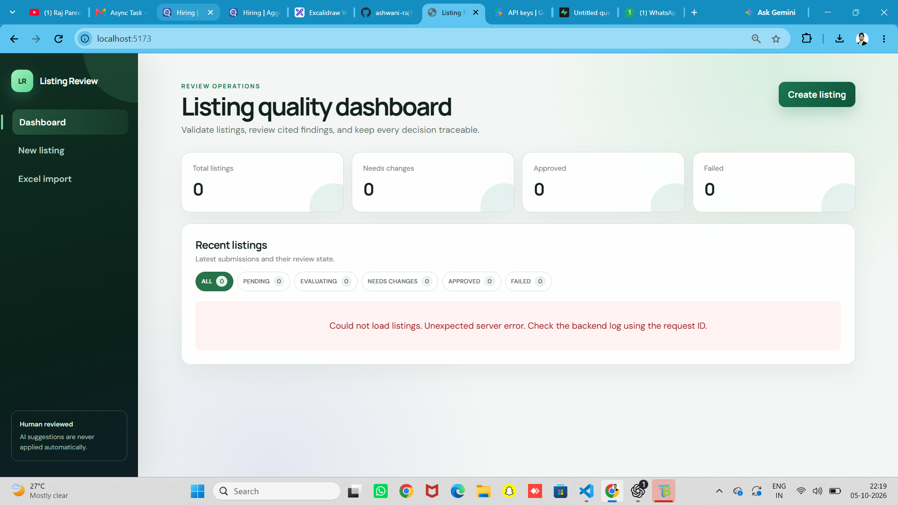
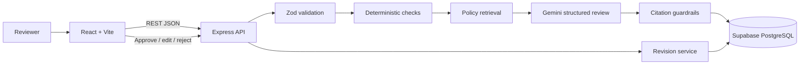
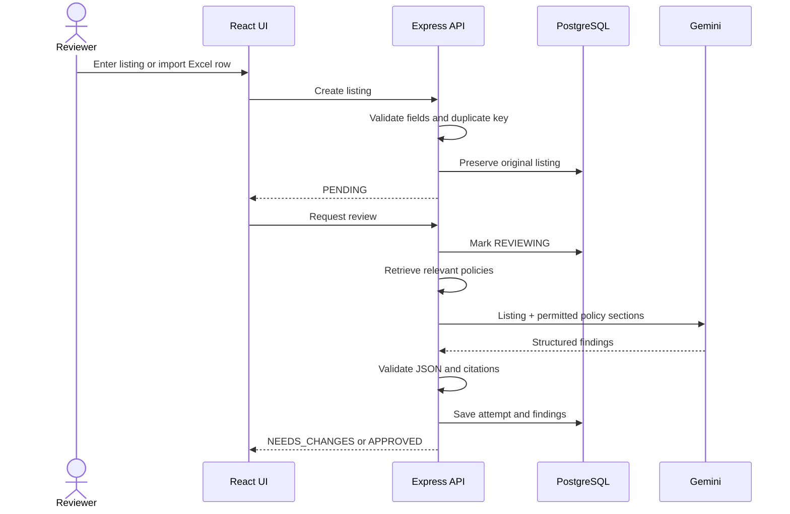
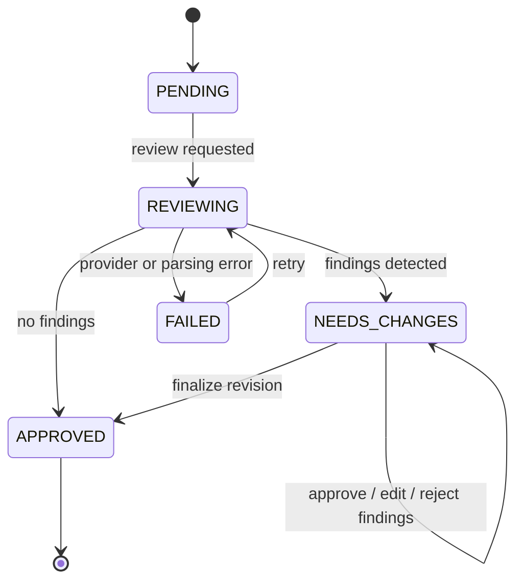
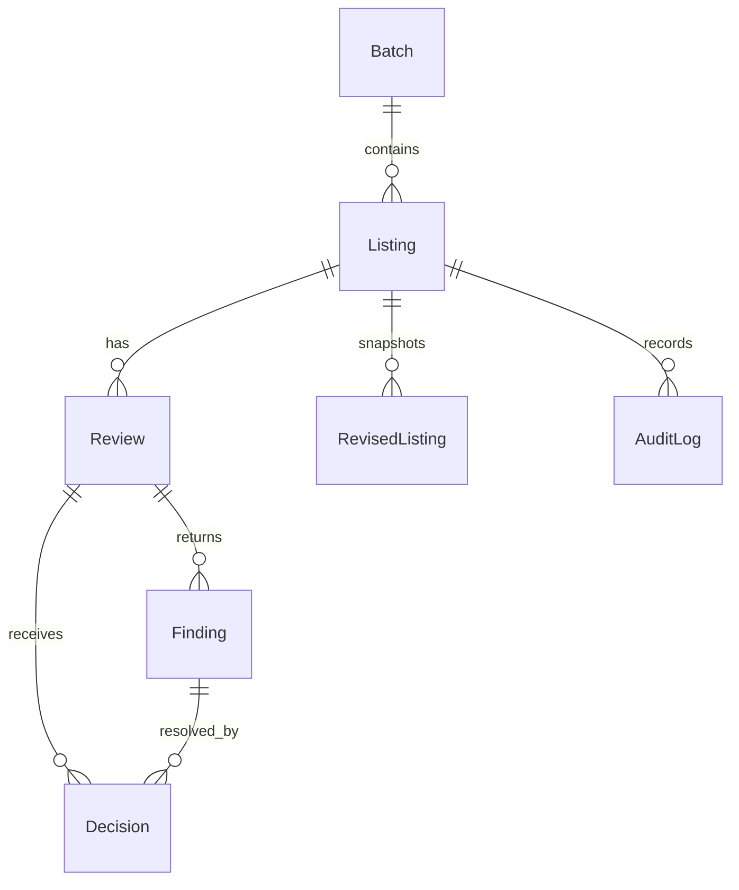

# Marketplace Listing Quality Reviewer

A human-in-the-loop application that validates marketplace listings, retrieves relevant policy guidance, generates cited AI findings, and lets reviewers approve, edit, or reject suggested revisions.

> **Submission scope:** one bounded marketplace policy set, six supported categories, manual entry, and Excel batches of up to 20 records. AI output is advisory and never changes a listing without human approval.

## Product snapshot



The dashboard includes explicit loading, empty, filtered, and failure states. This development snapshot demonstrates the database failure state rather than silently presenting an unavailable database as an empty result.

## Stack

- React, Vite, and TypeScript
- Express and TypeScript
- PostgreSQL and Prisma
- Zod validation
- Gemini 3.5 Flash Lite structured JSON output
- Vitest, React Testing Library, and Supertest

## Architecture



The backend follows a small layered design: routes coordinate the workflow, domain modules contain pure validation and policy logic, the Gemini service owns provider communication, Prisma persists workflow state, and middleware normalizes errors. Every request receives an `x-request-id` that also appears in structured Pino logs.

## End-to-end workflows

### Listing review



### Human approval lifecycle



Finalization creates an immutable `RevisedListing`; it never overwrites the original. Review attempts, raw AI output, findings, decisions, failures, revisions, and audit events remain available for traceability.

### Batch processing

The browser parses the first Excel worksheet, validates its shape, and submits at most 20 records. The API rejects duplicates within the batch and against persisted records, creates one `Batch`, and stores accepted listings. Reviews run sequentially so one failure does not hide other results and Gemini traffic stays bounded. Dashboard polling exposes each listing's live status.

## Deterministic rules

| Field | Constraint |
| --- | --- |
| Title | Required; 10–150 characters |
| Description | Required; 30–3,000 characters |
| Category | One of six supported categories |
| Price | ₹0.01–₹999,999.99; maximum two decimals |
| Seller | Required; maximum 120 characters |
| Tags | Maximum 10; each 2–30 characters |
| Image | Optional HTTP(S) URL or uploaded JPG/PNG/WebP |
| Batch | 1–20 listings |
| Duplicate | SHA-256 of normalized seller, category, and title |

Categories: `ELECTRONICS`, `FASHION_APPAREL`, `HOME_KITCHEN`, `HEALTH_WELLNESS`, `COLLECTIBLES_ART`, and `SERVICES`.

## AI workflow and guardrails

The retriever scores universal and category-specific policy sections using category relevance and keyword matches. Only the top relevant sections are sent to Gemini. Gemini runs at temperature `0` and must return a fixed JSON schema containing the affected field, issue type, severity, explanation, supporting evidence, policy code, and optional suggested wording.

Three controls are applied before findings reach the reviewer:

1. Zod rejects malformed responses and unknown enum values.
2. Citation validation rejects policy codes that were not included in that review's retrieved context.
3. Human approval prevents AI text from being applied automatically.

The prompt explicitly prohibits invented specifications. Missing information may be flagged as incomplete, but suggested copy cannot manufacture product facts.

## Data model



Images are compressed in the browser and stored in `attributes.__imageUrl` for this bounded demonstration. Production should use object storage and retain only an asset URL in PostgreSQL.

## Repository structure

```text
frontend/src/pages/       Dashboard, creation, Excel import, review workbench
frontend/src/api.ts       API wrapper
frontend/src/styles.css   Responsive visual system
backend/src/domain/       Validation, duplicate, policy, and AI schemas
backend/src/services/     Gemini integration
backend/src/app.ts        REST routes and workflow orchestration
backend/prisma/           Schema, Supabase bootstrap SQL, and seed
samples/listings.json     Import-ready sample data
```

## Local setup

1. Copy `.env.example` to `backend/.env` and provide a Supabase PostgreSQL transaction-pooler connection string and Gemini API key.
2. Install dependencies with `npm install`.
3. Generate the Prisma client with `npm run db:generate -w backend`.
4. Open `backend/prisma/init.sql` in Supabase SQL Editor and run it once to create the schema.
5. Seed policies with `npm run db:seed -w backend`.
6. Start both applications with `npm run dev`.

The frontend runs at `http://localhost:5173` and the API at `http://localhost:4000`.

The seed command is idempotent and also adds six reviewer-friendly sample listings covering compliant content, medical claims, authenticity claims, incomplete services, refurbished electronics, and home goods.

### Supabase note

The transaction pooler uses port `6543`. The backend uses Prisma's PostgreSQL driver adapter with a one-connection `pg` pool to avoid prepared-statement collisions. Prisma schema-management commands can still fail through transaction pooling, so the initial schema is supplied as `backend/prisma/init.sql` for the Supabase SQL Editor.

For verified TLS, download the server root certificate from **Supabase → Project Settings → Database → SSL Configuration**, save it as `backend/certs/prod-supabase.crt`, and configure:

```env
DATABASE_CA_CERT_PATH=./certs/prod-supabase.crt
```

The certificate and `backend/.env` are ignored by Git. Never solve certificate errors by disabling TLS verification.

## Core workflow

Listings first pass deterministic checks for required fields, supported categories, price format, length limits, and duplicates. Valid listings are matched to relevant policy sections and reviewed by the AI. Every AI finding must cite a retrieved policy section. Suggestions are proposals only and require explicit reviewer approval, editing, or rejection.

## Excel import format

The first worksheet uses these columns:

| Column | Required | Example |
| --- | --- | --- |
| `title` | Yes | `Wireless noise-cancelling headphones` |
| `description` | Yes | `Over-ear headphones with...` |
| `category` | Yes | `ELECTRONICS` |
| `price` | Yes | `12999.00` |
| `seller` | Yes | `Acme Audio` |
| `tags` | No | `wireless, audio, travel` |
| `imageUrl` | No | `https://example.com/item.webp` |
| `attributes` | No | JSON object or supported key/value text |

## API guide

| Method | Endpoint | Purpose |
| --- | --- | --- |
| `GET` | `/api/health` | Database and AI readiness |
| `GET` | `/api/config` | Supported categories and limits |
| `GET` | `/api/policies` | Bounded policy catalogue |
| `GET` | `/api/listings` | Dashboard collection |
| `POST` | `/api/listings` | Validate and create one listing |
| `GET` | `/api/listings/:id` | Listing, reviews, revisions, and history |
| `POST` | `/api/batches` | Create an Excel-derived batch |
| `POST` | `/api/listings/:id/review` | Run policy retrieval and Gemini review |
| `POST` | `/api/reviews/:reviewId/findings/:findingId/decisions` | Approve, edit, or reject a finding |
| `POST` | `/api/reviews/:reviewId/finalize` | Create an immutable revised snapshot |

## Current scope

- Single listing creation
- Excel (`.xlsx`/`.xls`) batches of up to 20 listings
- Optional listing image URL and image previews
- Indian rupee price formatting
- Live Pending, Evaluating, Needs Changes, Approved, and Failed status views
- Deterministic validation
- Policy retrieval and cited AI review
- Field-level decisions and revised snapshots
- Review and approval history

## Excluded scope

Publishing, payments, image moderation, seller verification, unrestricted categories, and large-scale batch infrastructure are intentionally excluded.

## Tests

Run all tests with:

```bash
npm test
```

Run the full quality gate before deployment:

```bash
npm run lint
npm test
npm run build
```

Tests focus on validation boundaries, duplicate keys, batch duplicates, policy scoring, AI response parsing, and citation verification. With the app running, `GET http://localhost:4000/api/health` should return `database: connected` and `aiConfigured: true`.

## Deployment

The frontend is designed for Vercel, the Express API for Render or Railway, and PostgreSQL for Neon or Supabase. Deployment URLs and final verification details will be added before submission.

### Frontend

Deploy `frontend`, build with `npm run build`, publish `dist`, and set `VITE_API_BASE_URL` to the hosted API URL ending in `/api`.

### Backend

Build with `npm install && npm run build -w backend` and start with `npm run start -w backend`. Configure `DATABASE_URL`, `DATABASE_CA_CERT_PATH`, `GEMINI_API_KEY`, `GEMINI_MODEL`, and `CLIENT_ORIGIN`. Store the Supabase certificate as a secret file, not in Git.

Before submission, verify health, manual creation, Excel import, one successful AI review, all three decision actions, finalization, retry behavior, and page refresh persistence.

## Troubleshooting

- **Dashboard cannot load listings:** call `/api/health`, match its request ID to the backend log, and verify the Supabase URL and certificate path.
- **`prepared statement already exists`:** use the included PostgreSQL adapter and restart stale backend processes; transaction pooling does not support prepared statements.
- **Gemini review failed:** verify the API key/model, restart the backend, and retry. Failed attempts remain in history.
- **Excel import failed:** use `.xlsx`/`.xls`, verify the documented headers, and keep the batch at 20 rows or fewer.

## Security and limitations

- Secrets, database passwords, and certificates must never be committed.
- The frontend never receives the Gemini key or database password.
- Images are displayed but not moderated.
- Retrieval is deterministic category/keyword scoring rather than a vector database.
- Authentication, marketplace publishing, payments, and seller verification are outside scope.
- Batch processing is bounded and sequential rather than distributed.
