<p align="center">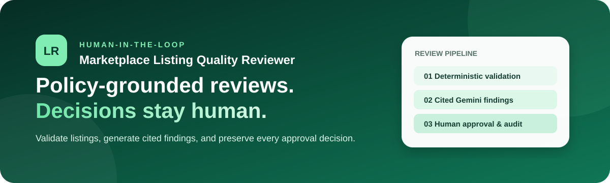</p>

<p align="center">
  <a href="https://aggroso-azure.vercel.app"><strong>Live application</strong></a> ·
  <a href="https://aggroso-pn34.onrender.com/api/health"><strong>API health</strong></a> ·
  <a href="frontend/public/samples/marketplace-sample-listings.xlsx"><strong>Sample Excel workbook</strong></a>
</p>

<p align="center">
  
  
  
  
  
  
</p>

# Marketplace Listing Quality Reviewer

A deployed human-in-the-loop workbench that checks marketplace listings with deterministic rules, retrieves relevant policy guidance, generates cited Gemini findings, and leaves every proposed revision under reviewer control.

> **Bounded scope:** one marketplace, six supported categories, manual entry, and Excel batches of up to 20 rows. Publishing, payments, seller verification, unrestricted categories, and image moderation are intentionally excluded.

## Contents

- [Features](#features)
- [Walkthrough](#walkthrough)
- [Screenshots](#screenshots)
- [Architecture](#architecture)
- [Workflows](#workflows)
- [AI guardrails](#ai-guardrails)
- [Data model](#data-model)
- [Setup](#setup)
- [Excel import](#excel-import)
- [API](#api)
- [Testing and logs](#testing-and-logs)
- [Deployment](#deployment)
- [Limitations and security](#limitations-and-security)

## Features

| Area | Final behaviour |
| --- | --- |
| Intake | Manual form, local image upload or URL, INR price, tags, validation, and review-before-submit modal |
| Batch | `.xlsx`/`.xls` parsing, preview with images, 20-row limit, duplicate protection, downloadable sample workbook |
| Deterministic checks | Required fields, price, category allowlist, lengths, tag limits, and normalized duplicate detection |
| AI review | Relevant policy retrieval, structured Gemini output, evidence, severity, cited policy code, suggested wording |
| Background work | PostgreSQL-backed `PENDING` queue processed by Express after the browser closes |
| Human control | Approve, edit, or reject every finding before creating an immutable revised snapshot |
| Operations | Live Pending, Evaluating, Needs Changes, Approved, and Failed dashboard states |
| History | Original record, attempts, raw AI output, findings, decisions, revisions, failures, retries, and audit events |
| Deletion | Confirmation dialog, active-review protection, cascade cleanup, and retained deletion audit tombstone |
| Demo content | Ten image-backed seeded samples and six different Excel-import examples |

## Walkthrough

<p align="center"><a href="docs/video/project-walkthrough.mp4"></a></p>

<p align="center">
  <a href="docs/video/project-walkthrough.mp4"><strong>▶ Open narrated MP4</strong></a> ·
  <a href="docs/video/project-walkthrough-audio.mp3"><strong>🔊 Open narration</strong></a>
</p>

GitHub does not reliably embed an MP4/audio player inside README files. The GIF below plays directly on the page; the linked 1280×720 MP4 includes narration.

<details><summary><strong>Play inline animated preview</strong></summary>

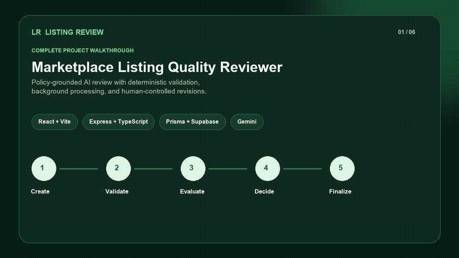

</details>

The walkthrough covers the architecture, repository, validation, policy-grounded Gemini review, human decisions, audit history, and Excel workflow. The final screenshots and diagrams below additionally document background processing, form confirmation, expanded product facts, image-backed samples, and deletion.

## Screenshots

### Operations dashboard

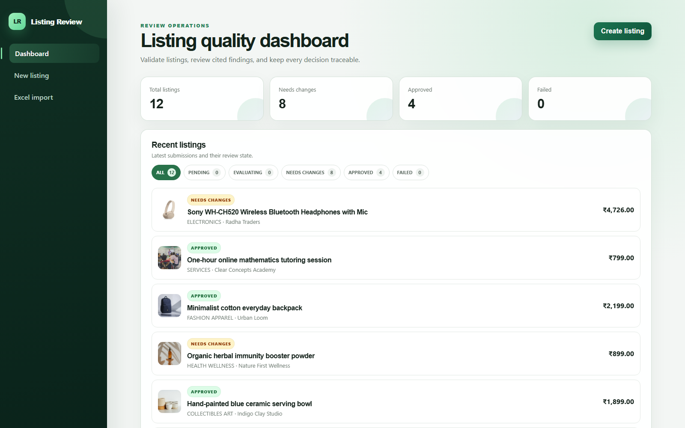

The dashboard reads persisted server state. It polls only while records are queued or evaluating.

### Manual intake

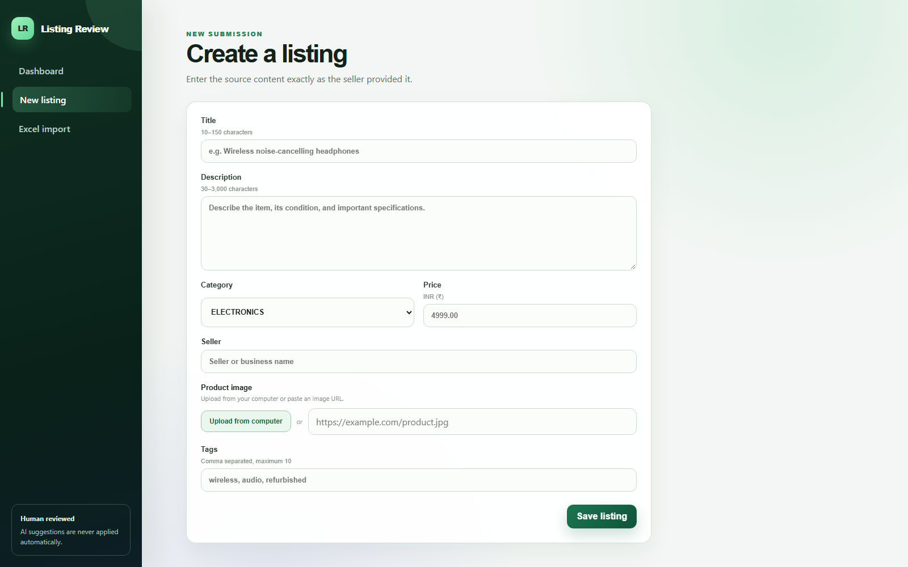

**Save listing** first opens a review-details modal. No database record is created until the reviewer confirms **Submit for AI review**.

### Excel intake

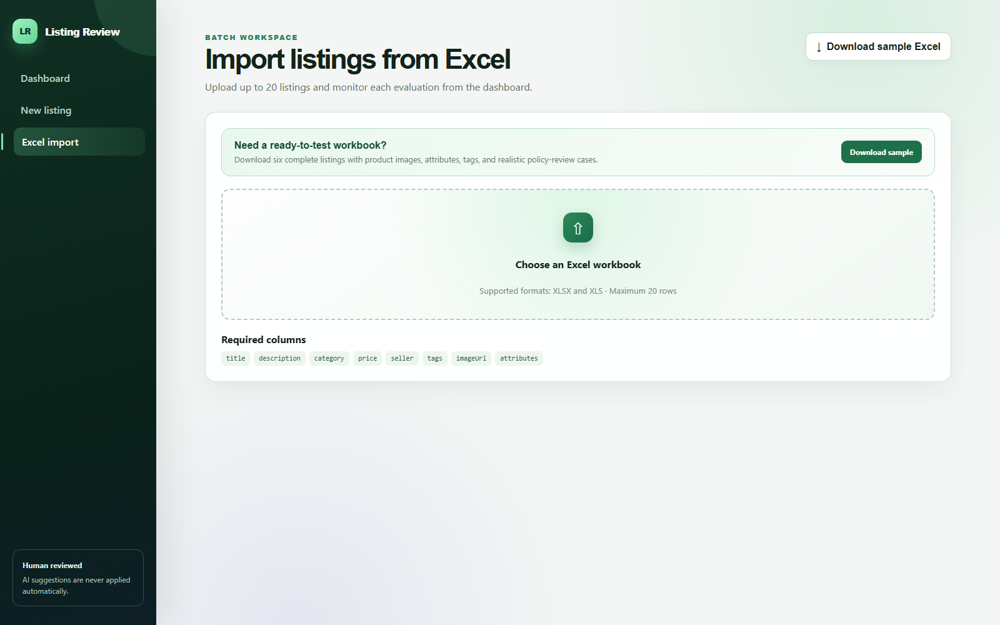

The page includes a ready-to-upload workbook with complete product data, image URLs, tags, and JSON attributes.

### Product and review workbench

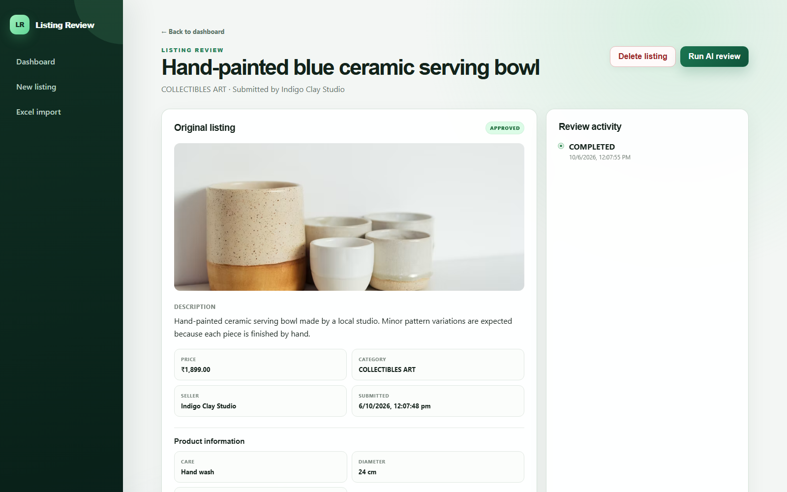

The detail view displays the source image and copy, price, category, seller, submission time, attributes, tags, review history, findings, decisions, and guarded deletion.

### Product journey

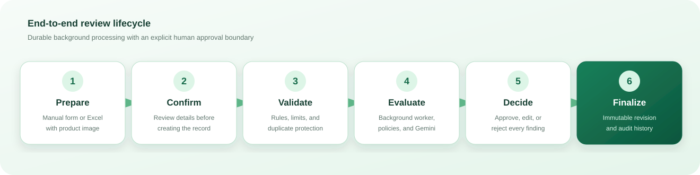

## Architecture

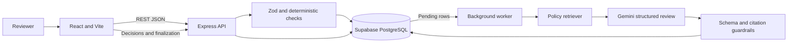

The API owns all durable state transitions. Closing the browser does not cancel work because queue state, attempts, findings, failures, and decisions are stored in PostgreSQL. Every request receives an `x-request-id`; workflow events use structured Pino JSON logs.

### Stack

| Frontend | Backend | Data and AI | Quality and hosting |
| --- | --- | --- | --- |
| React 19, Vite, TypeScript, TanStack Query, React Router | Express 5, Zod, Pino | Prisma, PostgreSQL, Gemini | Vitest, Supertest, Vercel, Render, Supabase |

### Repository structure

```text
frontend/src/pages/       Dashboard, form, Excel import, review workbench
frontend/src/api.ts       Browser API wrapper
frontend/src/styles.css   Responsive UI and confirmation dialogs
frontend/public/samples/  Downloadable Excel workbook
backend/src/domain/       Rules, policy retrieval, AI schemas, samples
backend/src/services/     Gemini client, worker, sample bootstrap
backend/src/app.ts        REST routes and workflow transitions
backend/prisma/           Prisma schema, SQL bootstrap, seed
docs/                     Screenshots, diagrams, walkthrough media
samples/                  JSON reviewer fixtures
```

## Workflows

### Manual creation and automatic AI review

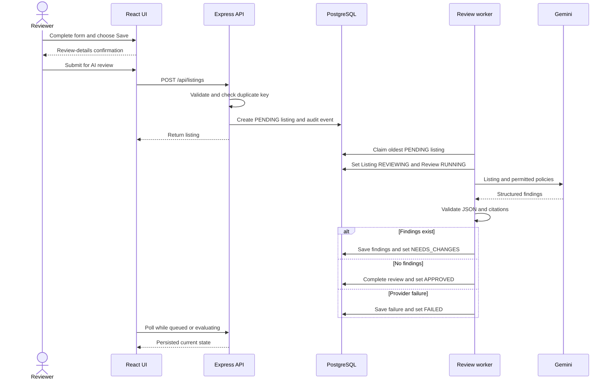

The worker is sequential to limit provider pressure. On startup, reviews left `RUNNING` for more than ten minutes are failed and their listings are requeued.

### Excel batch

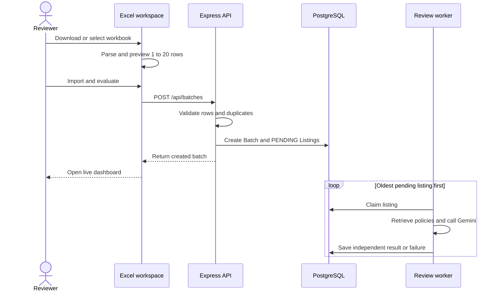

One failed row does not block the rest, and browser closure does not cancel processing.

### Human approval

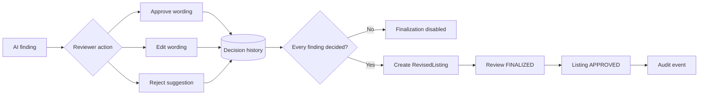

Gemini never overwrites the source. Finalization creates a separate immutable snapshot.

### Status lifecycle

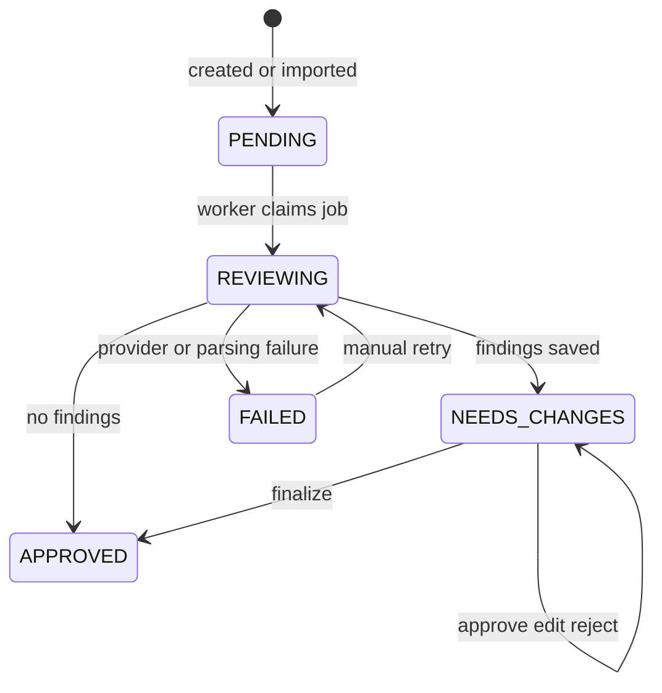

### Deletion

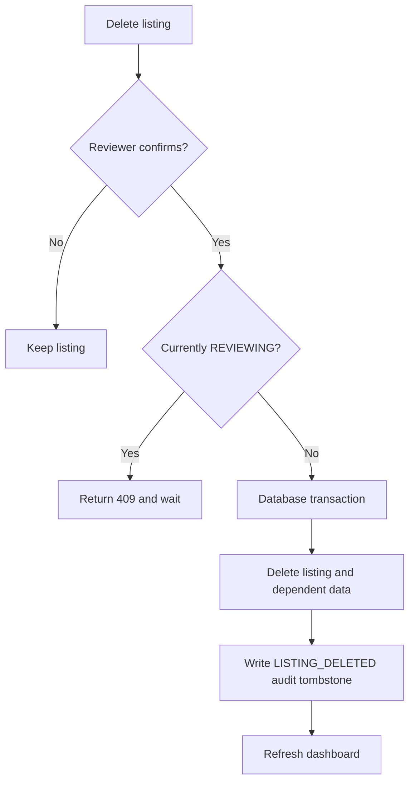

The tombstone also prevents a deleted seeded example from reappearing after restart.

## Deterministic rules

| Field | Rule |
| --- | --- |
| Title | Required, 10–150 characters |
| Description | Required, 30–3,000 characters |
| Category | One of six supported categories |
| Price | ₹0.01–₹999,999.99, maximum two decimals |
| Seller | Required, maximum 120 characters |
| Tags | Maximum 10, each 2–30 characters |
| Image | Optional HTTP(S) URL or uploaded JPG/PNG/WebP |
| Batch | 1–20 listings |
| Duplicate | SHA-256 of normalized seller, category, and title |

Categories: `ELECTRONICS`, `FASHION_APPAREL`, `HOME_KITCHEN`, `HEALTH_WELLNESS`, `COLLECTIBLES_ART`, and `SERVICES`.

## AI guardrails

1. Universal and category-specific policies form the candidate set.
2. Keyword relevance selects only the most applicable policy sections.
3. Gemini must return the prescribed structured JSON.
4. Zod rejects malformed responses and invalid enum values.
5. Every cited `policyCode` must be in the exact context supplied to that request.
6. The prompt prohibits invented product facts.
7. Suggested text remains advisory until a human decision is recorded.

Each finding includes the affected field, issue type, severity, explanation, evidence, policy code, and optional wording. The raw AI output and retrieved policy-code allowlist are retained with the review.

## Data model

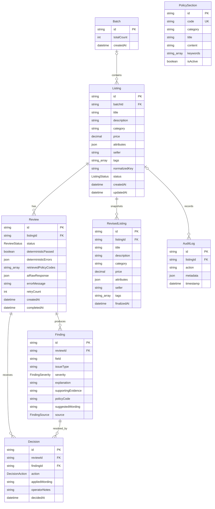

`PolicySection` deliberately has no foreign key to `Finding`. The backend validates findings against the retrieved code allowlist saved on their review. Images are stored in `attributes.__imageUrl` for this bounded demo; production should use object storage.

## Setup

### Prerequisites

- Node.js 22+
- Supabase PostgreSQL project
- Gemini API key

### Install and run

```bash
npm install
npm run db:generate -w backend
npm run dev
```

Before the first run:

1. Copy `backend/.env.example` to `backend/.env`.
2. Configure `DATABASE_URL`, `GEMINI_API_KEY`, and `CLIENT_ORIGIN`.
3. Run `backend/prisma/init.sql` once in Supabase SQL Editor.
4. Optionally run the idempotent `npm run db:seed -w backend`.
5. Copy `frontend/.env.example` only if the API is not `http://localhost:4000/api`.

Local frontend: `http://localhost:5173` · Local API: `http://localhost:4000`.

### Environment variables

| Name | Service | Purpose |
| --- | --- | --- |
| `DATABASE_URL` | Backend | PostgreSQL connection string |
| `DATABASE_CA_CERT_PATH` | Backend | Optional CA file path |
| `GEMINI_API_KEY` | Backend | Server-only Gemini credential |
| `GEMINI_MODEL` | Backend | Defaults to `gemini-3.5-flash-lite` |
| `CLIENT_ORIGIN` | Backend | Comma-separated allowed frontend origins |
| `PORT` | Backend | Defaults to 4000; Render supplies it |
| `VITE_API_BASE_URL` | Frontend | Hosted API base ending in `/api` |

The app uses Prisma's PostgreSQL adapter, a bounded `pg` pool, keep-alive, and verified TLS. Schema creation uses `backend/prisma/init.sql` because migration commands are unreliable through Supabase transaction pooling. `prisma generate` creates the client, not database tables.

## Excel import

Download [`marketplace-sample-listings.xlsx`](frontend/public/samples/marketplace-sample-listings.xlsx). It contains six records distinct from the ten seeded examples.

| Column | Required | Example |
| --- | --- | --- |
| `title` | Yes | `Wireless noise-cancelling headphones` |
| `description` | Yes | 30–3,000 characters |
| `category` | Yes | `ELECTRONICS` |
| `price` | Yes | `12999.00` |
| `seller` | Yes | `Acme Audio` |
| `tags` | No | `wireless, audio, travel` |
| `imageUrl` | No | Public HTTP(S) image URL |
| `attributes` | No | `{"condition":"Used"}` |

## API

| Method | Endpoint | Purpose |
| --- | --- | --- |
| `GET` | `/api/health` | Database and AI readiness |
| `GET` | `/api/config` | Categories and limits |
| `GET` | `/api/policies` | Policy catalogue |
| `GET` | `/api/listings` | Dashboard collection |
| `POST` | `/api/listings` | Create one pending listing |
| `GET` | `/api/listings/:id` | Full listing and history |
| `DELETE` | `/api/listings/:id` | Delete a settled listing with audit tombstone |
| `POST` | `/api/batches` | Create a validated Excel batch |
| `POST` | `/api/listings/:id/review` | Worker review or manual retry |
| `POST` | `/api/reviews/:reviewId/findings/:findingId/decisions` | Approve, edit, or reject |
| `POST` | `/api/reviews/:reviewId/finalize` | Create revised snapshot |

Errors contain a stable code, human-readable message, and request ID for log correlation.

## Testing and logs

```bash
npm run lint
npm test
npm run build
```

There are **14 passing backend tests** across five files. They cover validation boundaries, normalized and batch duplicates, policy ranking, AI parsing, citation enforcement, CORS, and the image-backed sample catalogue. Frontend verification currently uses TypeScript production builds and browser smoke tests rather than component tests.

Pino events include request metadata, record IDs, AI start/completion/failure, selected policy codes, finding counts, worker dispatch/recovery, decisions, finalization, and deletion.

## Requirement coverage

| Requirement | Evidence |
| --- | --- |
| Usable frontend | Responsive dashboard, confirmation modal, Excel import, review decisions, product details, deletion dialog |
| Working backend | Express, Zod, normalized errors, health diagnostics, guarded transitions |
| Persistence | PostgreSQL stores listings, batches, reviews, findings, decisions, revisions, policies, audits |
| Functional LLM workflow | Policy retrieval feeds Gemini; schema and citation allowlists guard output |
| Human approval | No suggestion is auto-applied; every finding requires a decision |
| UI states | Loading, empty, validation, queued, evaluating, success, failure, and retry |
| Background processing | Server worker survives browser closure and recovers stale jobs |
| Structured logs | Request IDs and workflow events are correlated with stable record IDs |
| Tests | 14 passing focused tests plus production builds |
| Documentation | README, AGENT_USAGE, env examples, diagrams, screenshots, workbook, walkthrough |
| Deployment | Live Vercel frontend, Render API, Supabase database |

## Deployment

| Endpoint | Live value |
| --- | --- |
| Frontend | [https://aggroso-azure.vercel.app](https://aggroso-azure.vercel.app) |
| API health | [https://aggroso-pn34.onrender.com/api/health](https://aggroso-pn34.onrender.com/api/health) |
| Authentication | Not required for this bounded assignment |

### Vercel

- Root: `frontend`
- Build: `npm run build`
- Output: `dist`
- `VITE_API_BASE_URL=https://aggroso-pn34.onrender.com/api`
- `frontend/vercel.json` provides SPA rewrites.

### Render

- Build: `npm ci --include=dev && npm run build -w backend`
- Start: `npm run start -w backend`
- Health: `/api/health`
- Required: `DATABASE_URL`, `GEMINI_API_KEY`, `CLIENT_ORIGIN`

Render's free instance may sleep after inactivity, making the first request slower. Pending work remains durable and resumes when the service runs again.

## Troubleshooting

| Symptom | Resolution |
| --- | --- |
| `Failed to fetch` | Check API health, Vercel `VITE_API_BASE_URL`, and Render `CLIENT_ORIGIN` |
| Missing tables | Run `backend/prisma/init.sql` in Supabase SQL Editor |
| Prepared statement error | Use the committed driver adapter and transaction-pooler configuration |
| TLS error | Use the bundled/public CA or valid `DATABASE_CA_CERT_PATH`; never disable verification |
| Gemini model 404 | Use the configured current model and redeploy the backend |
| Listing remains Pending | Check worker logs; processing resumes after Render wakes |
| Excel rejected | Use documented headers, valid JSON attributes, supported categories, maximum 20 rows |
| Delete disabled | Wait for the active review to finish |

## Limitations and security

- Never commit credentials, API keys, database passwords, tokens, or private certificates.
- Gemini and database credentials exist only on the backend.
- Images are displayed but not moderated; production should use object storage.
- Retrieval is category/keyword scoring rather than vector search.
- The worker is a bounded single process, not a distributed queue.
- Authentication, multi-tenancy, publishing, payments, and seller verification are outside scope.

## Submission files

- [`AGENT_USAGE.md`](AGENT_USAGE.md) — tools, prompts, mistakes, and verification
- [`.env.example`](.env.example), [`backend/.env.example`](backend/.env.example), [`frontend/.env.example`](frontend/.env.example) — names only, no secrets
- [`marketplace-sample-listings.xlsx`](frontend/public/samples/marketplace-sample-listings.xlsx) — import-ready workbook
- [`samples/listings.json`](samples/listings.json) — JSON fixtures
